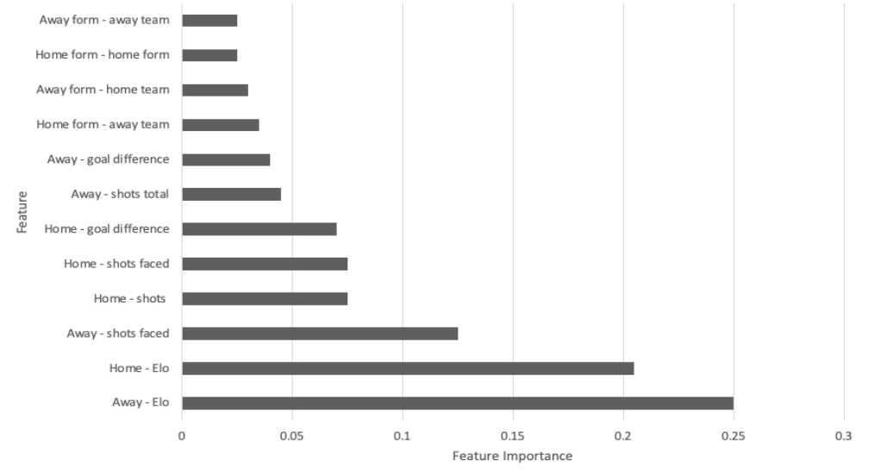
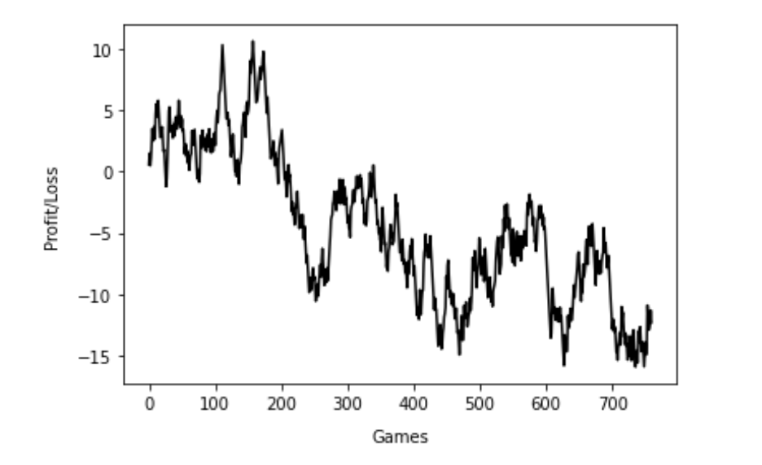

# Football Predictions

## Objective 

The aim of this project was to create a predictive model for the English Premier League using data in the public domain and using the limited computational power available to the average sports fan. 

## Overview

The final model (neural network) correctly predicted the football match outcomes (win, loss or draw) with an impressive accuracy of 55.92% over 720 games. This compared favourably to that achieved by the major betting companies whose models attained an accuracy of 56.05%.

12 features were used for the neural network with the most important feature being an engineered feature called Elo (a rating system that is primarily used for chess players).

Diffrent betting strategies were then deployed to try and generate a profit from the models predictions. The majority of betting strategies resulted in a loss. Some strategies did result in a profit, but these were limited, and it was not possible to confirm if these were statistically significant.

## Features 

### Elo
The main feature of the model was a team's Elo rating. Elo rating is a way of determining a persons/teams skill level relative to other persons/team by giving them a rating system. Conventionally, this is not used to rate football teams; however, I believed it could be a very good inidcator of a teams skill level and thus be used to help determine the chances of a team winning when the play another team.

A teams Elo rating is based on there overall match result history and is updated based on the result of the previous game. If a team with a low Elo beats a team with a strong Elo then their rating is updated proportionaly higher and vice versa.

Key considerations when using Elo:

___1) Should the size of a teams victory/loss be taken into account?___

A team winning 9-0 is very different to a team winning 1-0; however, the Elo rating will not take this into account. Therefore, the original Elo rating system was changed in order to accomodate for this. Teams that win or lose by a large margin will have their Elo updated by more than if they had won or lost by a close margin.

___2) Should a teams Elo stay the same across different seasons?___

A teams true skill level will not be the same at the start of the season e.g. key players may transfer teams etc; however, if you restart all teams Elo you lose too much valuable data about the teams skill level.

Therefore, at the start of every new season a teams Elo was bought closer to the average. E.g. if Team was rated 1400, Team B were rated 1200 and the average league rating was 1300, at the start of the next season Team A would be 1350 and Team B would be 1250.

___3) What should new (promoted) teams be rated when they enter the league?___

Promoted teams are given 90% of the average of the leagues Elo rating as statistically they perform worse than the average Premier League team.

### Form 

Form is slightly different to Elo and measures the short term performance of a team. Form was calculated by using a formula orinigally proposed in a paper by Baboota and Kaur (Baboota, R. and Kaur, H., 2019, Predictive analysis and modelling football results using machine learning approach for English Premier League, International Journal of Forecasting, 35(2), pp.741-755). Teams were given a score ranging from 0 to 1 based on the results of their previous 4 matches.

### Match Statistics 

A variety of match statistics were used e.g. number of shots, possession, goals conceded etc.

## Feature Importance

## Example Betting Strategy 

The figure below shows a simple betting strategy with the cumulative profit/loss resulting from placing a £1 bet on William Hill (betting compaany) for every game of the 2018/19 and 2019/20 season using the model predictions.  

Over the entirety of the two seasons, this simple betting strategy resulted in a loss of £12.90. 

## Data Discovery

The original dataset was from Kaggle (https://www.kaggle.com/louischen7/football -results-and-betting-odds-data-of-epl) and had a range of statistics about Premier League games and results dating from 2000/01 to the current day. The datset was split into three different types of statistics:

1) The match result e.g. Home win, draw, away win

2) Match statistics e.g. home/away possession percentage

3) Betting odds before the game had started: e.g. Team A have a 65% of winning the game

